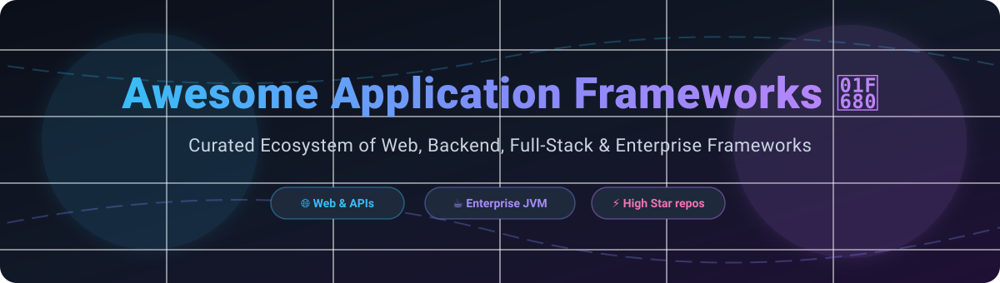

# 🚀 Awesome Application Framework 🛠️

  

  
  
  
  

---

## 📌 Overview & Market Insights 💡

The **Application Framework** market encompasses web frameworks, backend frameworks, full-stack ecosystems, and enterprise API runtimes.

> 📈 **Estimated Market Size & Dynamics**:  
> The global web and application development framework market is estimated at **$25+ Billion** and growing rapidly with expanding SaaS and enterprise cloud adoption. The sector is **moderately fragmented**: standard open-source runtimes (like Spring Boot, Next.js, and Django) dominate developer adoption in a "winner-take-most" distribution per programming language ecosystem, while specialized commercial platforms cater to high-end enterprise workloads.

---

## 📑 Table of Contents

- [🏢 Commercial & Managed Platforms](#-commercial--managed-platforms)
- [⚡ Open-Source Application Frameworks](#-open-source-application-frameworks)
  - [🟨 JavaScript & TypeScript](#-javascript--typescript)
  - [🐍 Python](#-python)
  - [☕ Java & JVM](#-java--jvm)
  - [🐘 PHP](#-php)
  - [💎 Ruby](#-ruby)
  - [🐹 Go & 🦀 Rust](#-go--rust)
- [🤝 How to Contribute](#-how-to-contribute)
- [💖 Support & Community](#-support--community)
- [⭐ Star History](#-star-history)
- [⚠️ Disclaimer](#%EF%B8%8F-disclaimer)

---

## 🏢 Commercial & Managed Platforms

The table below outlines enterprise-backed and commercial application frameworks, sorted descending by company size (valuation / annual revenue).

| Platform / Vendor 🏢 | Revenue / Valuation 💰 | Starting Pricing 🏷️ | Free Tier / Trial Limits 🎁 | Key Features & Architecture ⚙️ |
| :--- | :--- | :--- | :--- | :--- |
| **[.NET / ASP.NET](https://dotnet.microsoft.com/)** *(Microsoft)* | **~$3 Trillion Market Cap** | $0/mo (Open Source SDK); Visual Studio Pro starts at $45/mo | Fully free & open source SDK; Visual Studio Community edition free for individual developers & small teams | Enterprise cross-platform framework (.NET 8/9), MVC, Blazor, Web APIs, high-performance CLR runtime |
| **[Firebase Suite](https://firebase.google.com/)** *(Google)* | **~$2.1 Trillion Market Cap** | Pay-as-you-go (Blaze plan starts at $0 base + usage) | Spark Plan: Free forever (1 GB storage, 10k phone auths/mo, 20k writes/day, 50k reads/day) | Managed backend framework with real-time database, authentication, serverless functions, and hosting |
| **[AWS Amplify](https://aws.amazon.com/amplify/)** *(Amazon)* | **~$2 Trillion Market Cap** | Pay-as-you-go ($0.015/build min, $0.15/GB served) | Free Tier: 12 months free (1,000 build minutes/mo, 5 GB storage, 15 GB served/mo) | Complete client/server framework for building mobile & full-stack web apps on AWS infrastructure |

---

## ⚡ Open-Source Application Frameworks

Below is a comprehensive list of top open-source application frameworks sorted in descending order by GitHub Stars_Counts ⭐.

### 🟨 JavaScript & TypeScript

| Framework 🚀 | GitHub_Stars 🌟 | License 📜 | Ecosystem & Use Case 🎯 |
| :--- | :--- | :--- | :--- |
| **[Next.js](https://github.com/vercel/next.js)** |  | MIT | Full-stack React framework with SSR, SSG, App Router, and Server Actions |
| **[Angular](https://github.com/angular/angular)** |  | MIT | Complete enterprise TypeScript frontend framework from Google |
| **[NestJS](https://github.com/nestjs/nest)** |  | MIT | Progressive TypeScript Node.js framework with Angular-inspired modular architecture |
| **[Express.js](https://github.com/expressjs/express)** |  | MIT | Fast, unopinionated, minimalist web and API framework for Node.js |
| **[Nuxt](https://github.com/nuxt/nuxt)** |  | MIT | The intuitive Vue.js full-stack framework with SSR and auto-imports |
| **[SvelteKit](https://github.com/sveltejs/kit)** |  | MIT | High-performance full-stack framework powered by Svelte compile-time architecture |

---

### 🐍 Python

| Framework 🚀 | GitHub_Stars 🌟 | License 📜 | Ecosystem & Use Case 🎯 |
| :--- | :--- | :--- | :--- |
| **[Django](https://github.com/django/django)** |  | BSD-3-Clause | Batteries-included Python framework with built-in ORM, admin UI, and authentication |
| **[FastAPI](https://github.com/fastapi/fastapi)** |  | MIT | Modern, high-performance async API framework based on OpenAPI & Pydantic |
| **[Flask](https://github.com/pallets/flask)** |  | BSD-3-Clause | Lightweight Python WSGI microframework for flexible application composition |
| **[Pyramid](https://github.com/Pylons/pyramid)** |  | BSD-derived | Scalable Python web framework bridging micro-frameworks and full-stack systems |

---

### ☕ Java & JVM

| Framework 🚀 | GitHub_Stars 🌟 | License 📜 | Ecosystem & Use Case 🎯 |
| :--- | :--- | :--- | :--- |
| **[Spring Boot](https://github.com/spring-projects/spring-boot)** |  | Apache-2.0 | Standard enterprise Java runtime with auto-configuration and microservices ecosystem |
| **[Quarkus](https://github.com/quarkusio/quarkus)** |  | Apache-2.0 | Kubernetes-native Java framework optimized for GraalVM native images and serverless |
| **[Vert.x](https://github.com/eclipse-vertx/vert.x)** |  | Apache-2.0 | Reactive, event-driven polyglot application toolkit for high-throughput services |
| **[Micronaut](https://github.com/micronaut-projects/micronaut-core)** |  | Apache-2.0 | Modern JVM framework featuring compile-time dependency injection and low memory footprint |

---

### 🐘 PHP

| Framework 🚀 | GitHub_Stars 🌟 | License 📜 | Ecosystem & Use Case 🎯 |
| :--- | :--- | :--- | :--- |
| **[Laravel](https://github.com/laravel/framework)** |  | MIT | Premier PHP web framework featuring Eloquent ORM, Blade, and extensive ecosystem |
| **[Symfony](https://github.com/symfony/symfony)** |  | MIT | High-performance enterprise PHP component framework powering major web applications |
| **[CodeIgniter4](https://github.com/codeigniter4/CodeIgniter4)** |  | MIT | Lightweight PHP framework engineered for developers who need simple and elegant toolkits |

---

### 💎 Ruby

| Framework 🚀 | GitHub_Stars 🌟 | License 📜 | Ecosystem & Use Case 🎯 |
| :--- | :--- | :--- | :--- |
| **[Ruby on Rails](https://github.com/rails/rails)** |  | MIT | Iconic full-stack web framework emphasizing convention over configuration and fast MVP delivery |
| **[Sinatra](https://github.com/sinatra/sinatra)** |  | MIT | Classy DSL micro-framework for rapidly building web applications in Ruby |

---

### 🐹 Go & 🦀 Rust

| Framework 🚀 | GitHub_Stars 🌟 | License 📜 | Ecosystem & Use Case 🎯 |
| :--- | :--- | :--- | :--- |
| **[Gin](https://github.com/gin-gonic/gin)** |  | MIT | High-performance HTTP web framework written in Go featuring a custom Radix tree router |
| **[Fiber](https://github.com/gofiber/fiber)** |  | MIT | Express-inspired web framework built on top of Fasthttp for Go |
| **[Actix Web](https://github.com/actix/actix-web)** |  | MIT/Apache-2.0 | Extremely fast, pragmatic, and type-safe async web framework for Rust |
| **[Axum](https://github.com/tokio-rs/axum)** |  | MIT | Ergonomic and modular Rust web application framework built with Tokio and Tower |
| **[Echo](https://github.com/labstack/echo)** |  | MIT | High performance, minimalist Go web framework with HTTP/2 support and middleware |

---

## 🤝 How to Contribute

Contributions are warmly welcomed! Please follow these simple guidelines:

1. 🍴 Fork this repository.
2. 📝 Add or update framework entries in `README.md`.
3. 🎯 Ensure descriptions are concise, accurate, and properly formatted with Stars_Badges linking to stargazers pages.
4. 🚀 Submit a Pull Request with a clear description of your additions!

Check out awesome resources across the ecosystem: [Awesome Awesome Awesome](https://github.com/ishandutta2007/Awesome-Awesome-Awesome).

---

## 💖 Support & Community

If you find this curated application framework list helpful, please consider supporting the project:

- ⭐ **Star this repository** to help others discover it!
- 🔀 **Fork & Share** with your developer network and engineering teams.
- 💬 **Join our Discord** community on [Discord](https://discord.gg/jc4xtF58Ve) to discuss frameworks and architecture.
- ☕ **Sponsor the Maintainer**: Buy us a coffee and support open-source curation on [GitHub Sponsors](https://github.com/sponsors/ishandutta2007).

---

## ⭐ Star History

---

## ⚠️ Disclaimer

- This list is **community-curated** for educational and architectural reference purposes.
- Always review security policies, licensing, and enterprise support compliance before integrating frameworks into production environments.

---

  <b>Crafted with ❤️ for developers, software architects, and engineering leaders worldwide.</b>

## ⭐ Star History

<a href="https://star-history.com/#ishandutta2007/Awesome-Application-Framework&Timeline" align="center">
  <picture>
    <source media="(prefers-color-scheme: dark)" srcset="assets/ishandutta2007_Awesome-Application-Framework_growth.svg">
    
  </picture>
</a>
